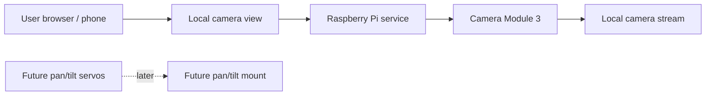

# pi-servocam-local


`pi-servocam-local` is a documentation-first Raspberry Pi camera project:
a local LAN camera built around a Raspberry Pi 5 and Raspberry Pi Camera
Module 3.

The goal is a small, understandable, self-hosted device that can be
opened from a phone or browser on the same network. No cloud service, no
public internet dependency, and no promise of production-ready camera
control yet. Pan/tilt movement is planned later, after the camera path is
understood.

## Quick Links

- [Project map](docs/PROJECT_MAP.md)
- [Hardware plan](docs/HARDWARE_PLAN.md)
- [Roadmap](docs/ROADMAP.md)

## Project Map



## Current Hardware

Currently available hardware:

- Raspberry Pi 5
- Raspberry Pi Camera Module 3

Planned later:

- Two servos for pan/tilt movement
- Pan/tilt mount
- Separate servo power supply if needed
- Optional battery or power pack

## Current Implementation Target

The next project stage is Camera Module 3 bring-up.

The first useful prototype should:

- Confirm that Camera Module 3 works on the Raspberry Pi 5.
- Document only tested camera setup steps after they are verified on the
  device.
- Prepare for a local LAN camera view later.

Servo control is future work. There should be no servo UI, pan/tilt
sliders, or movement controls until servos and mounting hardware are
selected and tested.

## Current Status

Status: **planning / documentation-first**.

This repository is currently defining the project shape before
implementation. It does not yet provide:

- A working backend service
- A working camera stream
- Servo movement
- Wiring diagrams
- Installation or startup commands

That is intentional. The first milestone is to make the project
understandable before adding moving parts.

## Planned Architecture

The planned system is intentionally small:

- A Raspberry Pi 5 will run a local service.
- A browser-based UI will be available only on the local network.
- The first implementation target is Camera Module 3 bring-up.
- A local LAN camera view will come after camera bring-up.
- Servo control will come later, after hardware selection.
- Servo limits and calibration will be added before any polished movement
  controls.

The project should stay readable, local-first, and hardware-conscious as
it grows.

## Local Network Model

The intended access model is:

- Device runs on a home or lab LAN.
- User opens the local camera view from a phone, tablet, or desktop
  browser.
- No cloud account is required.
- No public internet exposure is assumed.
- Remote access, tunneling, and WAN deployment are out of scope for the
  first stage.

## Safety / Hardware Notes

- Do not assume servo power can safely come directly from the Raspberry Pi
  5V pin.
- Larger or stalled servos can draw more current than the Raspberry Pi
  should provide.
- A separate servo power supply with a shared ground is usually the safer
  design.
- Exact wiring will be documented only after the hardware choices are
  confirmed.
- Servo travel limits and calibration matter; the mount should not be
  driven blindly into mechanical stops.

## Roadmap

- [x] repo documentation
- [ ] Camera Module 3 bring-up
- [ ] local LAN camera view
- [ ] pan/tilt hardware selection
- [ ] servo control and calibration
- [ ] optional enclosure/battery

See the full [roadmap](docs/ROADMAP.md) for phase-level planning.

## Repository Layout

```text
.
+-- README.md
`-- docs/
    +-- HARDWARE_PLAN.md
    +-- PROJECT_MAP.md
    `-- ROADMAP.md
```

## Project Note

This project starts with the README on purpose. Hardware projects are
easier to build, debug, and share when the goal, constraints, and system
map are visible early.

The next step is not to add a large framework. The next step is to bring
up Camera Module 3 on the Raspberry Pi 5, then document what actually
works on the device.
