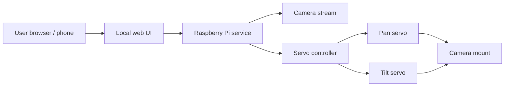

# Project Map

`pi-servocam-local` is planned as a small local-network camera device with two main capabilities:

- Show a camera stream from a Raspberry Pi Camera Module 2 or 3.
- Move the camera mount using separate pan and tilt servos.

The project is currently in a documentation-first planning stage. The diagram below describes the intended direction, not completed behavior.

## System Flow

## Components

### User Browser / Phone

The user interface is intended to run in a normal browser on a phone, tablet, or desktop connected to the same local network as the Raspberry Pi.

### Local Web UI

The local web UI will eventually show the camera view and provide simple pan/tilt controls. It should be practical rather than decorative: quick to load, clear on small screens, and usable on a LAN without cloud services.

### Raspberry Pi Service

The Raspberry Pi service is the planned local process that will coordinate the camera stream and servo commands. No backend has been implemented yet.

### Camera Stream

The camera stream will come from Raspberry Pi Camera Module 2 or Camera Module 3. Camera bring-up is a future milestone, not a current repository feature.

### Servo Controller

The servo controller will eventually translate UI intent into safe pan/tilt movement. Limits and calibration belong here before polished movement controls are considered complete.

### Pan Servo / Tilt Servo

The two servos provide horizontal and vertical movement. Exact servo model, power approach, and mounting geometry still need to be confirmed.

### Camera Mount

The mount is expected to hold the camera module and connect mechanically to the pan/tilt servos. The enclosure and final mounting design are future work.

## Design Direction

- Local-first and LAN-only by default
- Small enough to understand without heavy architecture
- Hardware notes documented before wiring is treated as final
- Incremental bring-up: documentation, camera, servos, limits, polish
