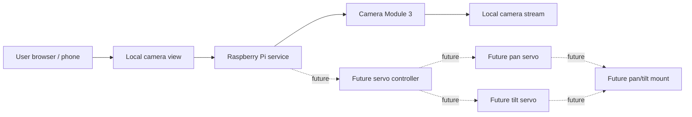

# Project Map

`pi-servocam-local` is planned as a small local-network camera device.
The current hardware focus is Camera Module 3 bring-up on Raspberry Pi 5.

Current target:

- Bring up Raspberry Pi Camera Module 3.
- Prepare for a local LAN camera view later.

Future target:

- Add pan/tilt movement after servos and mounting hardware are selected.

The project is currently in a documentation-first planning stage. The
diagram below describes the intended direction, not completed behavior.

## System Flow

## Components

### User Browser / Phone

The user interface is intended to run in a normal browser on a phone,
tablet, or desktop connected to the same local network as the Raspberry
Pi.

### Local Camera View

The local camera view will eventually show Camera Module 3 output on the
LAN. It should be practical rather than decorative: quick to load, clear
on small screens, and usable without cloud services.

### Raspberry Pi Service

The Raspberry Pi service is the planned local process that will
coordinate the camera path first. No backend has been implemented yet.

### Camera Stream

The camera path will use Raspberry Pi Camera Module 3. Camera bring-up is
the next implementation target, not a current repository feature.

### Servo Controller

The servo controller is future work. It will eventually translate UI
intent into safe pan/tilt movement after servo hardware is selected.
Limits and calibration belong here before polished movement controls are
considered complete.

### Pan Servo / Tilt Servo

The planned servos will provide horizontal and vertical movement. Exact
servo model, power approach, and mounting geometry still need to be
confirmed.

### Camera Mount

The mount is expected to hold the camera module and connect mechanically
to the pan/tilt servos. The enclosure and final mounting design are
future work.

## Design Direction

- Local-first and LAN-only by default
- Small enough to understand without heavy architecture
- Hardware notes documented before wiring is treated as final
- Incremental bring-up: documentation, Camera Module 3, local LAN view,
  servos, limits, polish
